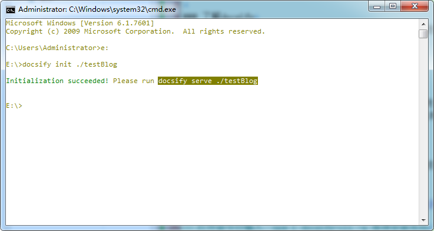
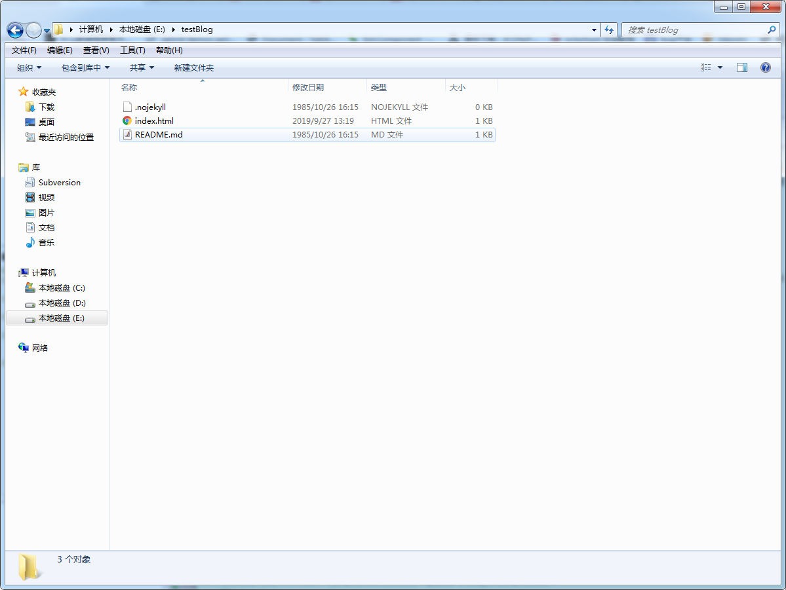
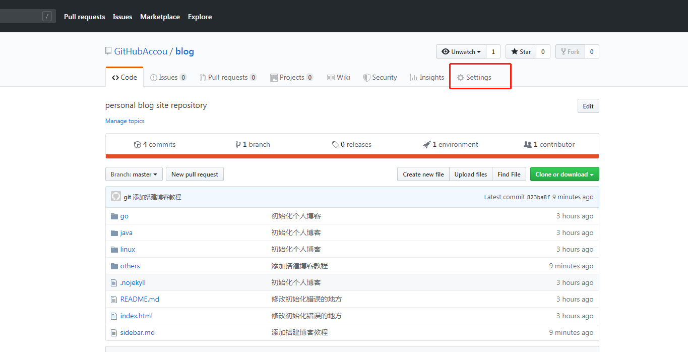
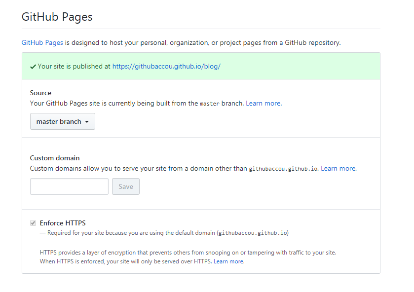
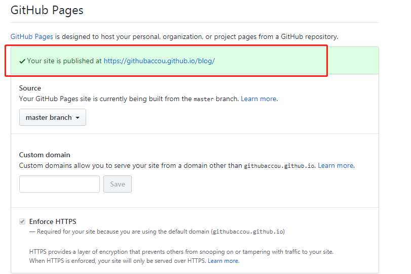

### 了解GitHubPages
Github Pages 是github 推出的服务，它允许你在github上搭建自己的静态网站（一般用于演示）。并且一个公网网址可供访问。GitHub Pages 上搭建的可用于公网访问的网站有一定的限制：
+ 需要github 账号，因为网站的域名为个人github账号+github.io（例如在github注册账号用户名为 easter，则网站访问的域名为 easter.github.io）。
+ 上面的一条同时也限制了一个账号最多只能有一个域名。
+ 上面存放的内容大小不超过1GB
+ 每个月不超过100GB的带宽
+ 每个小时修改不超过10次

### 了解docsify
docsify 是nodejs 提供的一个组件。它可以将markdown语法的文件渲染成HTML页面，生成静态网站。同时可以可以启动本地web服务，便于编写过程中实时查看效果。

### 使用GitHubPages+docsify的优势
+ 网站内容是github上的一个respository便于随时修改
+ markdown语法编写速度快
+ docsify启动本地web服务，可以随时查看效果
+ docsify生成的静态页面简洁清晰、自带目录。不用费时考虑复杂布局，生成的内容方便阅读
+ 省去自己搭建服务器、注册域名等复杂步骤，同时节省成本
+ 本地会存有备份，即使内网也可以访问自己写的博客

### 搭建步骤
**该部分以会安装和使用git并且已经注册了github账号为前提**
#### 1. 安装docsify
> ##### 1. 安装nodejs
>> 去nodeJs官网下载nodeJs安装包(下载地址[http://nodejs.cn/download/](http://nodejs.cn/download/))并安装
> ##### 2. npm 安装docsify
>> 打开命令行输入 `npm i docsify-cli -g`等待安装完成
#### 2. 测试docsify的安装结果
> ##### 1. 选择一个目录（例如e:）,创建testBlog文件夹。
> ##### 2. 打开命令行输入：
>> `e:`,回车,切换到E盘
>>
>> `docsify init ./testBlog` 初始化test文件夹，看到命令行提示初始化成功
>> 同时看到testBlog文件夹下多了有了三个文件
>> 
>>
>> `docsify serve ./testBlog` 启动本地web服务,看到命令行提示监听3000端口
>> 
> ##### 3. 打开浏览器输入 [http://localhost:3000](http://localhost:3000)。页面可以访问，说明docsify安装没问题
#### 3. 在github上创建博客仓库
> ##### 1. 创建一个空的仓库
>> 省略
> ##### 2. 仓库配置Github Pages
>> 打开上一步创建的空仓库(图中我的仓库名叫blog)，点击红色标注的部分
>> 
>> 打开之后，找到GitHub Pages部分，如图
>> 
>> 选择要使用的分支(主分支就可以),看到下面图中红色标注的部分说明博客网站已经建立完成
>> 
>> 使用红色标注给出的连接即可访问自己的博客，比如我的博客连接是:[https://githubaccou/github.io](https://githubaccou/github.io)
#### 4. 搭建博客基本框架
> 1. 将博客仓库从github拉取到本地
> 2. 编辑index.html如下：
>> ```html
>> <!DOCTYPE html>
>> <html lang="en">
>> <head>
>>   <meta charset="UTF-8">
>>   <title>Easter's Blog</title>
>>   <meta http-equiv="X-UA-Compatible" content="IE=edge,chrome=1" />
>>   <meta name="description" content="Description">
>>   <meta name="viewport" content="width=device-width, user-scalable=no, initial-scale=1.0, maximum-scale=1.0, minimum-scale=1.0">
>>   <link rel="stylesheet" href="//unpkg.com/docsify/lib/themes/vue.css">
>> </head>
>> <body>
>>   <div id="app"></div>
>>   <script>
>>     window.$docsify = {
>> 		loadSidebar:'sidebar.md',//侧边栏使用的markdown文件
>> 		autoHeader:true,
>> 		name:"Easter's Blog"//侧边栏上边显示的名称
>>     }
>>   </script>
>>   <script src="//unpkg.com/docsify/lib/docsify.min.js"></script>
>> </body>
>> </html>```
> 2. 添加sidebar.md
>> sidebar.md内容主要是链接形式的标题，用来链接每一片博客，也就是每一个.md文件。sidebar.md中添加如下内容：
>> ```markdown
>>[搭建个人博客](others/buildPersonalBlog)
>> ```
>> 上边表示这个点击这个链接，右边内容栏会显示others文件加下的buildPersonalBlog.md文件中的内容
> 3. 编辑others文件夹下的buildPersonalBolg.md文件，内容如下：
>> ```
>> 这是我在github的第一篇博文，用于测试
>> 测试一个链接： [百度](https://www.baidu.com)
>> 测试一个图片： [戚薇](https://ss1.bdstatic.com/kvoZeXSm1A5BphGlnYG/skin_zoom/460.jpg?2)
>> ```
> 4. git提交修改，并push到github。
> 5. 访问自己的博客地址，测试效果
#### 5. 到此所有内容已经结束，以后要做的是深入学习docsify的用法和添加自己的博客即可。

